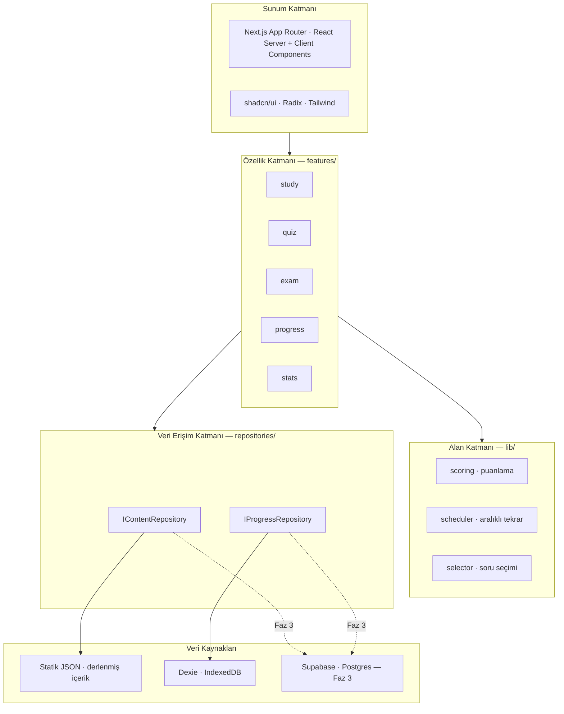
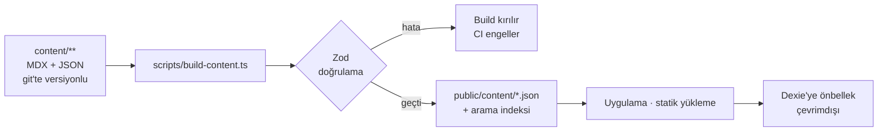
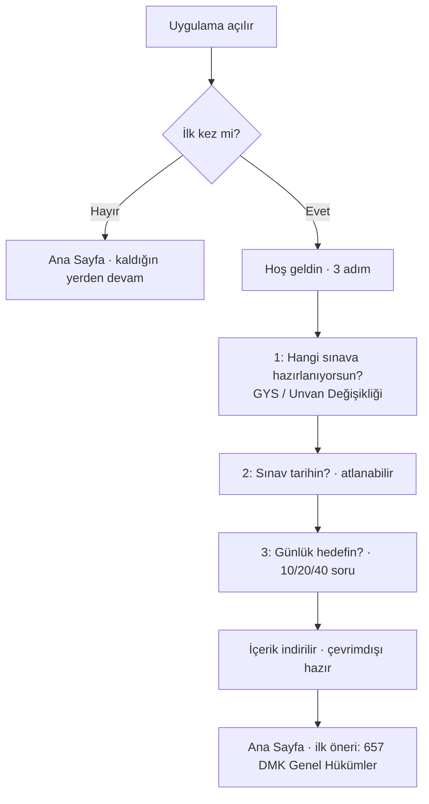
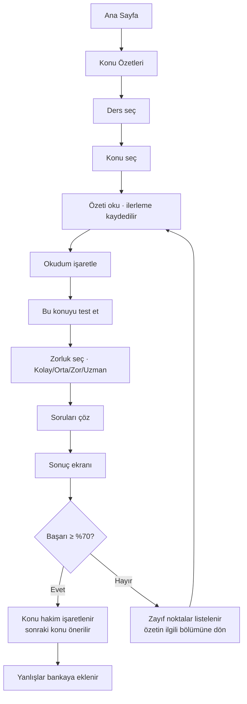
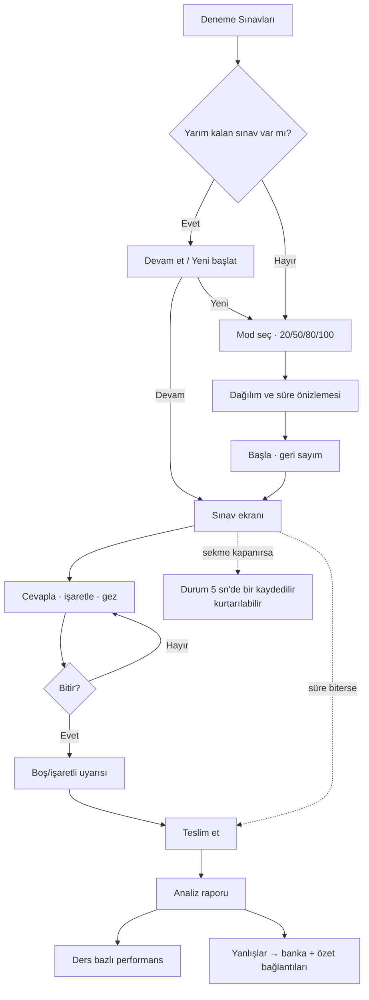
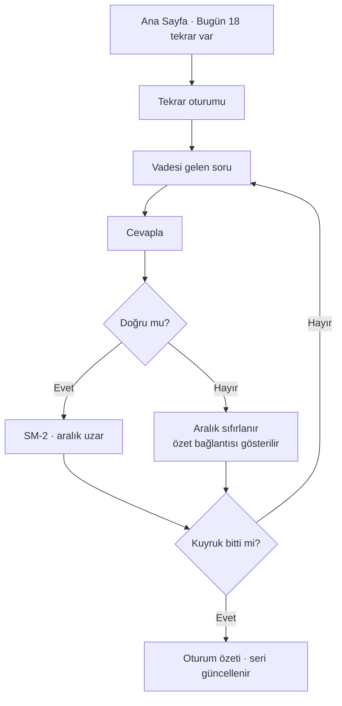

# Kamu Sınav Akademi — Proje Planı

> **Görevde Yükselme** ve **Unvan Değişikliği** sınavlarına hazırlık platformu
> Sürüm: 0.1 (Planlama) · Tarih: 21 Temmuz 2026 · Durum: **Kod yazımı öncesi mimari plan**

Bu belge; pazar araştırması, rakip analizi, sistem mimarisi, veri modeli, ekran listesi,
kullanıcı akışları ve yol haritasını içerir. Kod fazına bu belge onaylandıktan sonra geçilir.

---

## İçindekiler

1. [Yönetici Özeti](#1-yönetici-özeti)
2. [Hedef Kitle ve Personalar](#2-hedef-kitle-ve-personalar)
3. [Pazar ve Rakip Analizi](#3-pazar-ve-rakip-analizi)
4. [Farklılaşma Stratejisi](#4-farklılaşma-stratejisi)
5. [Sınav Gerçekleri ve İçerik Kapsamı](#5-sınav-gerçekleri-ve-i̇çerik-kapsamı)
6. [Ürün Kapsamı: MVP ve Sonrası](#6-ürün-kapsamı-mvp-ve-sonrası)
7. [Sistem Mimarisi](#7-sistem-mimarisi)
8. [Teknoloji Seçimleri ve Gerekçeleri](#8-teknoloji-seçimleri-ve-gerekçeleri)
9. [Veri Modeli](#9-veri-modeli)
10. [Klasör Yapısı](#10-klasör-yapısı)
11. [Ekran Listesi](#11-ekran-listesi)
12. [Kullanıcı Akışları](#12-kullanıcı-akışları)
13. [UI/UX ve Erişilebilirlik Sözleşmesi](#13-uiux-ve-erişilebilirlik-sözleşmesi)
14. [İçerik Üretim Hattı ve Telif Notu](#14-i̇çerik-üretim-hattı-ve-telif-notu)
15. [Kalite, Test ve CI/CD](#15-kalite-test-ve-cicd)
16. [Yol Haritası](#16-yol-haritası)
17. [Riskler ve Açık Sorular](#17-riskler-ve-açık-sorular)
18. [Sonraki Adım](#18-sonraki-adım)
19. [Kaynakça](#19-kaynakça)

---

## 1. Yönetici Özeti

### Ürün tanımı

Kamu personelinin Görevde Yükselme (GYS) ve Unvan Değişikliği sınavlarına hazırlanması için
tasarlanmış, web tabanlı, çevrimdışı çalışabilen bir eğitim platformu. İçerik üç ayaktan
oluşur: **sınav odaklı konu özetleri**, **zorluk kademeli konu testleri** ve **gerçek sınav
formatında deneme sınavları** — üçü de kişisel ilerleme takibiyle bağlanır.

### Farklılaşma tezi

> **Rakiplerin çözemediği sorun soru sayısı değil, güvendir.**
> Her sorunun hangi mevzuat maddesine dayandığı ve nereden geldiği görünür olacak; kullanıcı
> hatalı soruyu bildirebilecek ve bildirimin ne olduğunu takip edebilecek; içerik mevzuat
> sürümüyle damgalanacak. Buna, hedef kitlenin yaş profiline gerçekten uyan bir erişilebilirlik
> standardı eşlik edecek.

### Temel ürün kararları

| Karar | Seçim |
|---|---|
| İlk sürüm platformu | Web (mobil uyumlu, PWA) |
| Mobil | **Android — Capacitor ile aynı kod tabanından paketlenecek** (taahhüt edilmiş hedef) |
| Mimari yaklaşım | **Local-first**, backend'e hazır |
| MVP içerik kapsamı | Yalnızca **ortak konular**; ilk sürümde **3 ders** (657 DMK, Anayasa, Etik) |
| İçerik kaynağı | Resmî çıkmış sınav soruları + derleme → sonraki fazda AI destekli üretim + insan onayı |
| Üyelik | MVP'de yok; veri modeli ve katmanlar baştan çoklu kullanıcıya hazır |
| Gelir modeli | MVP'de yok, reklam yok. Ücretlendirme Faz 6 |

### Android kararının mimari sonucu

Android hedefi Capacitor ile aynı kod tabanından karşılanacak. Capacitor bir WebView'e
**statik dosya** yükler; arkasında Node sunucusu yoktur. Bu, sonraya bırakılabilecek bir
paketleme detayı değil, **bugünden bağlayıcı bir mimari kısıttır**:

- `output: "export"` kilitlidir. Server Actions, Route Handler, middleware ve ISR
  kullanılamaz.
- Her dinamik rota `generateStaticParams` ile tam olarak sayılmalıdır. Çalışma anında doğan
  rotalar (ör. `/sonuc/[oturumId]`) mümkün değildir — bu yüzden testin kurulum, çözme ve
  sonuç aşamaları tek rotada, bileşen durumunda tutulur.
- Build sırasında ağ bağımlılığı olamaz; bu nedenle `next/font/google` yerine sistem font
  yığını kullanılır.
- Sunucu gerektiren işler uygulamanın **içine** değil dışına konumlanır: Faz 3 kimlik
  doğrulama istemci SDK'sı ile, Faz 5 içerik üretimi repo içindeki ayrı bir araçla.

Kısıtı sonradan uygulamak pahalı olurdu; baştan uygulamak bedavadır.

### Neden local-first?

MVP'nin ilk günden sunucusuz çalışması üç şey kazandırır: **sıfır işletme maliyeti**
(statik hosting), **tam çevrimdışı kullanım** (metroda, kurum binasında zayıf bağlantıda
çalışma) ve **hız** (soru geçişleri ağ beklemez). Karşılığında çoklu cihaz senkronu
kaybedilir — bu, Faz 3'te tek bir katman değişikliğiyle geri kazanılacak şekilde
tasarlanmıştır (bkz. [§7](#7-sistem-mimarisi)).

---

## 2. Hedef Kitle ve Personalar

Hedef kitle: devlet memurları; şeflik, VHKİ (veri hazırlama ve kontrol işletmeni), bilgisayar
işletmeni, memur, şube müdürlüğü ve teknik unvan adayları.

### Persona 1 — "Şeflik adayı Hakan", 47

- 20 yıllık memur, ilk kez GYS'ye giriyor. Masaüstü/dizüstü ağırlıklı kullanıcı.
- Yakın görme zorluğu var; küçük punto ve düşük kontrast onu uygulamadan uzaklaştırır.
- İhtiyacı: **derli toplu özet + bol deneme**. Uygulama içi karmaşık jest ve animasyon istemiyor.
- Korkusu: "yanlış bilgiyle çalışıp sınavda kaybetmek."

### Persona 2 — "VHKİ adayı Elif", 31

- Mesai aralarında telefondan 10–15 dakikalık bloklarla çalışıyor.
- İhtiyacı: **kaldığı yerden devam**, hızlı 20 soruluk turlar, günlük seri (streak) motivasyonu.
- Veri kotası sınırlı → çevrimdışı çalışma ve düşük veri tüketimi kritik.

### Persona 3 — "Unvan değişikliği adayı Mehmet", 38

- Teknik kadroya (mühendis/tekniker) geçmek istiyor. Ortak konular onun için "kolay puan".
- İhtiyacı: ortak konularda **hızlı tam puan garantisi**; zayıf konuyu hızlı tespit edip kapatmak.
- Faz 4'te alan bilgisi modülünün asıl müşterisi.

**Ortak payda:** hepsi tam zamanlı çalışıyor, çalışma zamanı kıt, motivasyonu düşük tutan bir
arayüz doğrudan terk sebebi. Ürünün her ekranı "**bugün ne çalışmalıyım?**" sorusunu 3 saniyede
cevaplamalı.

---

## 3. Pazar ve Rakip Analizi

### İncelenen kaynaklar

| Platform | Tip | Öne çıkan |
|---|---|---|
| [KamuSınav.com](https://kamusinav.com/) | Web + mobil, abonelik | 2016'dan beri; kurum bazlı paketler, Discord topluluğu, canlı hoca desteği, PDF ders notları |
| [Sinavtime](https://sinavtime.com/) | Web + Android | MEB Şube Müdürlüğü odaklı, ~6.200 soruluk havuz iddiası |
| [MemurSinav.com](https://www.memursinav.com/) | Web, abonelik | GYS + unvan değişikliği online sınav merkezi |
| [Kariyer Sınav](https://www.kariyersinav.com/) | Web | Adalet Bakanlığı odaklı; ders notu + mevzuat + soru bankası |
| [Memurlar.net Sınav](https://sinav.memurlar.net/) | Web | Açıklamalı çözümler, kurum bazlı denemeler |
| Şube Müdürlüğü Sınavı (GYS) | iOS/Android | Konu anlatımı + soru bankası tek uygulamada |
| KPSS 2026 / KPSS Hazırlık 2026 | iOS/Android | Ürün olgunluğu en yüksek segment; aşağıdaki özellik listesi buradan çıkarıldı |

### 3.1 Rakiplerin güçlü yönleri (alınacak dersler)

| # | Güçlü yön | Bizim karşılığımız |
|---|---|---|
| 1 | Büyük soru havuzu (6.000–20.000+) | Hacimde yarışmayacağız; **kalite + referans** ile yarışacağız. Uzun vadede Faz 5 üretim hattı |
| 2 | Gerçek sınav formatında deneme (süre + puan) | **MVP'de var** — 20/50/80/100 soru modları |
| 3 | Çevrimdışı mod | **MVP'de var** ve varsayılan (PWA) |
| 4 | Süre tutma, net takibi, ders bazlı dağılım | **MVP'de var** |
| 5 | Yanlış soruları tekrar çözme | **MVP'de var**, Faz 2'de aralıklı tekrarla güçlenecek |
| 6 | Favori soru + kişisel not | **MVP'de var** (yer imi + not) |
| 7 | Sınav geri sayım sayacı | **MVP'de var** (ayarlanabilir sınav tarihi) |
| 8 | İstatistik/analiz modülü | **MVP'de var**, Faz 2'de derinleşecek |
| 9 | Sosyal öğeler, liderlik tablosu, yarışma | Faz 6 — backend gerektiriyor |
| 10 | Canlı ders / topluluk desteği (Discord) | Kapsam dışı; ürün stratejisi değil, hizmet stratejisi |
| 11 | PDF ders notu indirme | Faz 2 — özetlerden PDF üretimi |

### 3.2 Rakiplerin zayıf yönleri (fırsat alanımız)

Şikâyet ve mağaza yorumlarından çıkan tekrarlayan örüntüler
([kaynak](https://www.sikayetvar.com/memursinavcom)):

| # | Zayıf yön | Sonuç | Fırsat |
|---|---|---|---|
| 1 | **Mevzuat değişince içerik güncellenmiyor** | Kullanıcı yürürlükten kalkmış bilgiyle çalışıyor | İçerik üstünde **mevzuat sürüm damgası** ve "son doğrulama tarihi" |
| 2 | **Hatalı soru bildirimleri düzeltilmiyor** | Güven kaybı, terk | **Görünür hata bildirimi akışı** + değişiklik günlüğü |
| 3 | Soru başına **kaynak/mevzuat referansı yok** | "Bu cevap neden doğru?" cevapsız kalıyor | Her soruda **madde referansı zorunlu alan** |
| 4 | Vaat edilen özellik teslim edilmiyor | İtibar kaybı | Yol haritasının kendisi ürün içinde şeffaf yayınlanır |
| 5 | Destek ulaşılamaz, ödeme/üyelik hataları | İade talepleri | MVP'de ödeme yok; Faz 6'da ödeme öncesi tam önizleme |
| 6 | Ücretsiz katmanlar reklam yoğun | Sınav sırasında dikkat dağınıklığı | **Reklam yok** — ürün ilkesi |
| 7 | Yaşça büyük kullanıcı için erişilebilirlik yok | 45+ segment zorlanıyor | **WCAG 2.2 AA** + 3 kademeli yazı boyutu + yüksek kontrast |
| 8 | Veri kilitli, dışa aktarılamıyor | Platform bağımlılığı | **JSON dışa/içe aktarma** |
| 9 | Yalnız mobil uygulama, masaüstü zayıf | Persona 1 dışlanıyor | Responsive web, klavyeyle tam kullanım |
| 10 | Konu ↔ soru bağı kopuk | Zayıf konu tespit edilse bile ne çalışacağı belirsiz | Her sorudan **ilgili özete tek tıkla** dönüş |

### 3.3 E-öğrenme ve quiz sistemlerinden alınan desenler

Udemy/Coursera tipi platformlar ve aralıklı tekrar uygulamalarından (Anki, Quizlet, FSRS
ekosistemi) alınacak desenler:

- **İlerleme çubuğu + tamamlanma yüzdesi** her modül kartında (Udemy'nin en etkili öğesi).
- **Kaldığın yerden devam** kartı ana sayfada tek ve baskın CTA.
- **Aralıklı tekrar** (SM-2 → sonra FSRS): yanlış yapılan soru rastgele değil, unutma
  eğrisine göre geri gelir. Rakiplerin hiçbirinde yok — belirgin üstünlük (Faz 2).
- **Mikro-oturum** tasarımı: her etkileşim 10 dakikada tamamlanabilir olmalı.
- **Sınav simülasyonu** gerçek koşulları taklit etmeli: geri dönüş, soru işaretleme,
  navigatör paneli, süre uyarıları.

---

## 4. Farklılaşma Stratejisi

Altı taahhüt. Bunlar pazarlama sloganı değil; **veri modeli ve mimari bunları zorunlu kılacak
şekilde tasarlandı** — yani sonradan vazgeçilmesi teknik olarak zor.

| # | Taahhüt | Teknik karşılığı |
|---|---|---|
| 1 | Her sorunun mevzuat dayanağı görünür | `Question.legalRef` **zorunlu alan**; Zod doğrulaması boş bırakılırsa build kırılır |
| 2 | Her sorunun kaynağı ve lisansı izlenebilir | `Question.source` zorunlu; telif denetimi mümkün |
| 3 | Kullanıcı hata bildirebilir, sonucu görebilir | `QuestionReport` varlığı + içerik değişiklik günlüğü |
| 4 | İçerik mevzuat sürümüyle damgalı | `TopicSummary.legislationVersion` + `lastVerifiedAt`; arayüzde rozet |
| 5 | Yaşça büyük kullanıcı için gerçek erişilebilirlik | WCAG 2.2 AA; CI'da axe-core kapısı |
| 6 | Veri kullanıcınındır | Tam JSON dışa/içe aktarma; hesap gerekmez |

---

## 5. Sınav Gerçekleri ve İçerik Kapsamı

### 5.1 Sınav formatı

99/12647 sayılı *Kamu Kurum ve Kuruluşlarında Görevde Yükselme ve Unvan Değişikliği Esaslarına
Dair Genel Yönetmelik* çerçeve kuralları koyar, ayrıntıyı her kurum kendi yönetmeliğiyle
belirler. Yaygın uygulama:

| | Görevde Yükselme | Unvan Değişikliği |
|---|---|---|
| Soru sayısı | Tipik **80** (kurumdan kuruma 60–80) | Tipik **50** |
| Süre | ~120 dakika | ~75 dakika |
| Başarı eşiği | 100 üzerinden **≥ 60** | 100 üzerinden **≥ 60** |
| Puanlama | Yanlış doğruyu **götürmez** | Yanlış doğruyu **götürmez** |
| İçerik | Ortak konular + alan bilgisi | Ağırlıklı alan/teknik bilgi |
| Ortak/alan dengesi | Alan bilgisi ağırlığı **%60'ın altına inemez** | — |

> ⚠️ **Mimari sonucu:** soru sayısı, süre ve konu dağılımı kurumdan kuruma değişiyor.
> Bu yüzden deneme sınavı şablonları **koda gömülmeyecek**, `MockExamTemplate` verisi olarak
> tutulacak. Yeni bir kurum formatı eklemek = yeni bir JSON satırı.

### 5.2 Ortak konu ağacı (MVP kapsamı)

Yönetmeliğin saydığı ortak konular ve alt başlıkları:

```
1. 657 Sayılı Devlet Memurları Kanunu
   ├── Genel Hükümler ve Kapsam
   ├── Temel İlkeler (sınıflandırma, kariyer, liyakat)
   ├── Ödevler ve Sorumluluklar
   ├── Genel Haklar (izin, sosyal haklar, mali haklar)
   ├── Yasaklar
   ├── Disiplin Cezaları ve Disiplin Amirleri
   ├── Değerlendirme ve Takdirname / Ödül
   ├── Atama, Yer Değiştirme, Görevlendirme
   └── Memurluğun Sona Ermesi

2. Türkiye Cumhuriyeti Anayasası
   ├── Genel Esaslar ve Cumhuriyetin Nitelikleri
   ├── Temel Hak ve Ödevler
   ├── Yasama (TBMM)
   ├── Yürütme (Cumhurbaşkanı, idare)
   └── Yargı (yüksek mahkemeler)

3. Resmî Yazışma Kuralları
   ├── Resmî Yazı Türleri ve Unsurları
   ├── Belgenin Biçimsel Özellikleri
   ├── Elektronik Belge ve E-imza
   └── Yazışma Usulü ve Onay

4. Türkçe Dil Bilgisi
   ├── Yazım Kuralları
   ├── Noktalama İşaretleri
   ├── Anlatım Bozuklukları
   └── Sözcük ve Cümle Bilgisi

5. Devlet Teşkilatı ile İlgili Mevzuat
   ├── Cumhurbaşkanlığı Teşkilatı
   ├── Bakanlıklar ve Bağlı/İlgili/İlişkili Kuruluşlar
   ├── Taşra Teşkilatı ve Mahalli İdareler
   └── Kamu İktisadi Teşebbüsleri

6. Atatürk İlkeleri ve İnkılap Tarihi
   ├── Kurtuluş Savaşı ve TBMM'nin Açılışı
   ├── Siyasi ve Hukuki İnkılaplar
   ├── Sosyal, Eğitim ve Ekonomik İnkılaplar
   └── Atatürk İlkeleri ve Dış Politika

7. Etik Davranış İlkeleri
   ├── Kamu Görevlileri Etik Kurulu ve Mevzuatı
   ├── Etik Davranış İlkeleri (5176 sayılı Kanun, yönetmelik)
   ├── Çıkar Çatışması ve Hediye Alma Yasağı
   └── Saydamlık ve Hesap Verebilirlik

8. Halkla İlişkiler ve İletişim
   ├── Halkla İlişkiler Temel Kavramları
   ├── Kamuda İletişim ve Protokol
   ├── Bilgi Edinme Hakkı (4982) ve CİMER
   └── Vatandaş Odaklı Hizmet Anlayışı

9. Kamu Yönetimi
   ├── Yönetim Bilimi Temelleri
   ├── Merkezden/Yerinden Yönetim
   ├── Kamu Personel Rejimi
   └── Denetim ve İdari Yargı
```

**MVP hedefi (karar):** içerik darboğazı nedeniyle ilk sürüm **3 dersle** çıkar —
**657 DMK, Anayasa, Etik**. Yukarıdaki 9 derslik ağaç hedef kapsamdır; kalan 6 ders
(Resmî Yazışma, Türkçe, Devlet Teşkilatı, Atatürk İlkeleri, Halkla İlişkiler, Kamu Yönetimi)
Faz 2'de doldurulur. Veri modeli ve arayüz zaten dokuzunu da taşır; eksik olan yalnızca
içeriktir ve uygulama içeriği olmayan konuyu "hazırlanıyor" olarak gösterir.

**Terk edilen hedef (kayıt için):** 9 ders, ~40 konu, konu başına 1 özet + en az 20 soru →
yaklaşık **800+
yayımlanmış soru**. Alan bilgisi ve kurum bazlı mevzuat Faz 4'e bırakıldı; veri modeli
`scope: 'ortak' | 'alan'` alanıyla bunu bugünden taşıyor.

### 5.3 Konu özeti yazım standardı

Her özet aşağıdaki sözleşmeye uyar (içerik hattı bunu doğrular):

- **Kısa:** 600–1.200 kelime, 8–12 dakikalık okuma.
- **Maddeli:** düz paragraf yerine numaralı/madde işaretli yapı.
- **Sınav odaklı:** "sınavda şu sorulur" vurgusu; ezberlenecek sayılar tabloda.
- **Vurgulu:** `<Kritik>` (mutlaka bilinmeli), `<Sayi>` (süre/gün/oran), `<Tuzak>`
  (karıştırılan ayrım) bileşenleri.
- **Referanslı:** her kritik bilgi madde numarasıyla (`<Madde kanun="657" no="125" />`).
- **Kapanış:** "Bir bakışta" özet kutusu + o konunun testine geçiş butonu.

---

## 6. Ürün Kapsamı: MVP ve Sonrası

### 6.1 MVP — olmazsa olmazlar

| Modül | Kapsam |
|---|---|
| **Ana Sayfa** | Kaldığın yerden devam, günlük hedef, sınav geri sayımı, zayıf konu önerisi |
| **Konu Özetleri** | 9 ders → konu listesi → okuma ekranı; okundu işareti, yer imi, not |
| **Testler** | Konu bazlı test; 4 zorluk (Kolay/Orta/Zor/Uzman); anında veya sonda geri bildirim |
| **Deneme Sınavları** | 20 / 50 / 80 / 100 soru; süre, soru navigatörü, işaretleme, kurtarma |
| **Sonuç ve Analiz** | Puan, başarı yüzdesi, ders bazlı doğru/yanlış, süre analizi, yanlış listesi |
| **İlerleme Takibi** | Tamamlanan konular, çözülen soru sayısı, başarı oranı, güçlü/zayıf konular |
| **İstatistikler** | Günlük çalışma grafiği, seri (streak), ders bazlı gelişim eğrisi |
| **Yanlışlarım** | Yanlış yapılan soruların bankası, yeniden çözme |
| **Ayarlar** | Yazı boyutu, tema, yüksek kontrast, sınav tarihi, veri dışa/içe aktarma |
| **Çevrimdışı** | PWA; ilk yüklemeden sonra tamamen çevrimdışı çalışır |

### 6.2 MVP'de bilinçli olarak **yok**

Üyelik/giriş, çoklu cihaz senkronu, ödeme, reklam, video ders, canlı ders, forum/sosyal,
liderlik tablosu, AI soru üretimi, kurum bazlı alan bilgisi, bildirim (push).

### 6.3 Sonraki sürümlerde eklenecekler

| Faz | Özellikler |
|---|---|
| **Faz 2** | Aralıklı tekrar (SM-2), gelişmiş analiz raporları, hata bildirimi akışı, özet→PDF, global arama |
| **Faz 3** | Üyelik (Supabase Auth), çoklu cihaz senkronu, bulut yedek |
| **Faz 4** | Kurum + kadro bazlı alan bilgisi; kuruma göre kişiselleştirilmiş sınav şablonu |
| **Faz 5** | AI destekli soru/özet üretimi + insan onay kuyruğu; "neden yanlış?" AI açıklaması |
| **Faz 6** | Ücretlendirme, mobil paketleme (Capacitor), sosyal/liderlik, push bildirim, öğretmen paneli |

---

## 7. Sistem Mimarisi

### 7.1 Katman diyagramı



### 7.2 Local-first, backend'e hazır sözleşme

Faz 3'te sunucu geldiğinde **arayüz kodunun tek satırı değişmeyecek**. Bunu garanti eden
dört kural, ilk günden uygulanır:

1. **Tek geçiş noktası.** UI ve `features/` katmanı Dexie'yi asla doğrudan görmez; her şey
   `IContentRepository` / `IProgressRepository` üzerinden geçer.
2. **`userId` baştan var.** Tüm ilerleme kayıtlarında `userId` alanı bulunur; MVP'de sabit
   `"local"` değerini alır. Senkron geldiğinde şema göçü gerekmez.
3. **Append-only olay günlüğü.** `QuestionAttempt` yalnızca eklenir, güncellenmez. İki cihazın
   denemeleri çakışmadan birleşir. Türetilmiş veriler (istatistik, ilerleme) bu günlükten
   yeniden hesaplanabilir.
4. **`updatedAt` damgası.** Append-only olmayan kayıtlarda (ayarlar, yer imi, konu ilerlemesi)
   çakışma çözümü *son yazan kazanır*.

### 7.3 İçerik hattı



İçerik **kod gibi** yönetilir: git'te durur, PR ile gözden geçirilir, şema doğrulaması
CI kapısıdır. Eksik `legalRef` veya 4'ten farklı sayıda şık = kırmızı build.

---

## 8. Teknoloji Seçimleri ve Gerekçeleri

### Frontend — **Next.js 16 (App Router) + React 19 + TypeScript (strict)**

**Neden:** `output: 'export'` ile tamamen statik çıktı üretir. Aynı çıktı hem web tarafında
ücretsiz statik hosting'e gider hem de Capacitor ile Android paketine girer — tek kod
tabanı, iki hedef. Dosya tabanlı yönlendirme, derleme zamanı ön-üretim ve PWA desteği hazır
gelir.

> ⚠️ Statik export bir tercih değil, Android hedefinin dayattığı kısıttır (bkz. §1).
> Sunucu gerektiren her ihtiyaç uygulamanın dışına konumlandırılır.

**Değerlendirilen alternatifler:**
- *Vite + React (saf SPA):* en basit kurulum, ancak SEO (organik trafik bu pazarda kritik) ve
  ileride sunucu tarafı ihtiyacında göç maliyeti doğurur. **Elendi.**
- *Astro:* içerik ağırlıklı kısımda mükemmel, ancak uygulamanın kalbi son derece etkileşimli
  (sınav motoru). **Elendi.**
- *SvelteKit:* teknik olarak uygun; ekosistem ve hazır erişilebilir bileşen kütüphanesi
  (Radix) React tarafında daha güçlü. **Elendi.**

### UI — **Tailwind CSS v4 + shadcn/ui (Radix Primitives)**

**Neden:** Radix; klavye navigasyonu, odak tuzağı, ARIA rolleri ve ekran okuyucu duyurularını
hazır verir. WCAG 2.2 AA hedefi bu sayede "ek iş" değil, varsayılan olur. shadcn/ui bileşenleri
`node_modules`'a değil repo'ya kopyalar → kurumsal tasarım diline serbestçe uyarlanır.
Tailwind token'ları yazı boyutu kademeleri ve yüksek kontrast modunu tek yerden yönetir.

### Durum yönetimi — **Dexie live query + Zustand**

| Durum tipi | Çözüm | Gerekçe |
|---|---|---|
| Asenkron veri (ilerleme) | **`useLiveQuery`** (Dexie), repository arayüzü arkasında | Veri değiştiğinde tüketici bileşenler kendiliğinden tazelenir; test bitince ana sayfa ve ilerleme ekranı elle geçersizleştirme olmadan güncellenir. Uygulamayı değiştirilebilir kılan şey kütüphane değil, repository katmanıdır — sunucu gelince yalnızca o katman değişir. |
| İçerik | Derleme zamanında sunucu bileşenlerinde okunur, prop olarak geçer | Statik export sayesinde çalışma anında hiç ağ isteği yok; tam çevrimdışı |
| Sınav oturumu (aktif soru, işaretler, kalan süre) | Bileşen durumu, oturum kapsamlı | Sınav durumu karmaşık ama kısa ömürlü ve tek ekrana ait; global store'a taşımak gereksiz kirlilik |
| Küresel UI tercihleri (tema, yazı boyutu) | **Zustand** (persist middleware) | Küçük, boilerplate'siz, seçici abonelikle gereksiz render üretmez |

**Redux Toolkit elendi:** bu ölçekte kurulum ve kavram yükü faydayı aşıyor.
**Salt Context elendi:** her değişimde tüketici ağacını yeniden render eder; sınav ekranındaki
saniyelik süre güncellemesi tüm ekranı yeniden çizerdi.

### Kalıcılık — **Dexie.js (IndexedDB)**

**Neden:** `localStorage` senkron çalışır (ana iş parçacığını kilitler) ve ~5 MB kotayla
sınırlıdır; binlerce soru, deneme geçmişi ve cevap günlüğü için yetersiz. IndexedDB asenkron
ve pratikte sınırsız. Dexie, ham IndexedDB API'sinin ağır ergonomisini gizler, sürümlü şema
göçü ve TypeScript tipi desteği sağlar.

### Backend (Faz 3) — **Supabase (PostgreSQL + Auth + RLS)**

**Neden:** Yönetilen Postgres, ilişkisel veri modelimize doğrudan oturur. Row Level Security,
"her kullanıcı yalnızca kendi ilerlemesini görür" kuralını **veritabanı seviyesinde** zorunlu
kılar — uygulama katmanındaki bir hata veri sızdıramaz. E-posta/OTP ile hazır kimlik doğrulama,
ücretsiz katman MVP sonrası için fazlasıyla yeterli, gerekirse self-host edilebilir.

**Değerlendirilen alternatifler:** *Firebase* (NoSQL, ilişkisel sorgularımıza uygun değil);
*özel NestJS + Postgres* (tam kontrol, ancak tek kişilik ekipte operasyon yükü erken gelir —
Faz 6'da ölçek gerekirse yeniden değerlendirilir).

### Veritabanı modeli notu

MVP'de içerik **salt-okunur statik JSON**, kullanıcı verisi **IndexedDB**'dir. Faz 3'te
içerik Postgres'e taşınmaz — statik kalır (CDN'den servis, çevrimdışı, ücretsiz). Yalnızca
**kullanıcı verisi** Postgres'e gider. Bu ayrım maliyeti düşük, çevrimdışı deneyimi güçlü tutar.

### Kimlik doğrulama tasarımı (bugünden hazırlık)

- Tüm ilerleme kayıtlarında `userId` alanı mevcut (`"local"` varsayılanı).
- `IAuthProvider` arayüzü MVP'de `LocalAuthProvider` (tek anonim kullanıcı) döner.
- Faz 3 geçişi: kullanıcı giriş yapınca yerel `"local"` kayıtları gerçek `userId` ile
  damgalanıp sunucuya tek seferlik yükleme yapılır — **veri kaybı olmadan yükseltme**.

---

## 9. Veri Modeli

### 9.1 İçerik tarafı (salt-okunur, git'te versiyonlu)

```ts
type ExamKind = 'gorevde-yukselme' | 'unvan-degisikligi';
type Scope    = 'ortak' | 'alan';
type Difficulty = 'kolay' | 'orta' | 'zor' | 'uzman';
type ContentStatus = 'draft' | 'review' | 'published';

/** Kurum — MVP'de tek kayıt ("genel"); Faz 4'te çoğalır. */
interface Institution {
  id: string;              // "meb", "adalet", "genel"
  name: string;
  shortName: string;
  examTemplates: string[]; // MockExamTemplate id'leri
}

/** Kadro / unvan — Faz 4'te alan bilgisini bağlar. */
interface CadrePosition {
  id: string;              // "sef", "vhki", "sube-muduru"
  name: string;
  institutionId: string;
  examKind: ExamKind;
  subjectWeights: Record<string, number>; // subjectId -> soru sayısı
}

/** Ders — 657, Anayasa, Etik... */
interface Subject {
  id: string;              // "657-dmk"
  name: string;
  scope: Scope;
  order: number;
  icon: string;            // lucide ikon adı
  description: string;
  topicIds: string[];
}

interface Topic {
  id: string;              // "657-dmk/disiplin-cezalari"
  subjectId: string;
  name: string;
  order: number;
  estimatedMinutes: number;
  questionCount: number;   // build sırasında hesaplanır
}

/** Konu özeti — kaynağı MDX dosyası. */
interface TopicSummary {
  topicId: string;
  slug: string;
  bodyPath: string;             // content/.../disiplin-cezalari.mdx
  keyPoints: string[];          // "Bir bakışta" kutusu
  legalRefs: LegalRef[];
  legislationVersion: string;   // "657 s.K. — 15.04.2026 tarihli hâli"
  lastVerifiedAt: string;       // ISO tarih — güven rozeti
  readingMinutes: number;
}

interface LegalRef {
  law: string;        // "657 sayılı Devlet Memurları Kanunu"
  lawId?: string;     // "657"
  article?: string;   // "125"
  clause?: string;    // "A/a"
  url?: string;       // mevzuat.gov.tr bağlantısı
}

/** Kaynak izlenebilirliği — telif denetimi için zorunlu. */
interface QuestionSource {
  kind: 'official-past-exam' | 'compiled' | 'original' | 'ai-draft';
  origin: string;     // "MEB GYS 2023 Şube Müdürlüğü" | "kurum içi yazım"
  year?: number;
  url?: string;
  license: 'public-official' | 'own-work' | 'unknown';
}

interface Question {
  id: string;
  subjectId: string;
  topicId: string;
  scope: Scope;
  difficulty: Difficulty;
  stem: string;                 // soru kökü (Markdown)
  options: [string, string, string, string];
  correctIndex: 0 | 1 | 2 | 3;
  explanation: string;          // detaylı açıklama — ZORUNLU
  legalRef: LegalRef;           // mevzuat referansı — ZORUNLU
  source: QuestionSource;       // kaynak — ZORUNLU
  status: ContentStatus;        // yalnızca 'published' kullanıcıya gider
  tags: string[];
  version: number;
  updatedAt: string;
}

/** Deneme şablonu — kurum formatları veri olarak tutulur. */
interface MockExamTemplate {
  id: string;                   // "gys-80", "unvan-50", "hizli-20"
  name: string;
  examKind: ExamKind;
  questionCount: 20 | 50 | 80 | 100;
  durationSeconds: number;
  passingScore: number;         // 60
  negativeMarking: false;
  distribution: Array<{ subjectId: string; count: number; difficultyMix?: Partial<Record<Difficulty, number>> }>;
}
```

**Zorunluluk kararı:** `explanation`, `legalRef` ve `source` isteğe bağlı **değil**.
Bu üç alan farklılaşma tezinin taşıyıcısı; opsiyonel yapılırsa zamanla boş kalır.

### 9.2 Kullanıcı tarafı (IndexedDB, Faz 3'te senkronlanabilir)

```ts
/** Append-only olay günlüğü — tüm istatistiklerin kaynağı. */
interface QuestionAttempt {
  id: string;               // uuid
  userId: string;           // MVP: "local"
  questionId: string;
  subjectId: string;
  topicId: string;
  selectedIndex: 0 | 1 | 2 | 3 | null;   // null = boş bırakıldı
  isCorrect: boolean;
  durationMs: number;
  context: 'practice' | 'exam' | 'review';
  sessionId: string;
  createdAt: string;
}

interface TopicProgress {
  userId: string;
  topicId: string;
  summaryRead: boolean;
  summaryReadAt?: string;
  questionsAttempted: number;
  questionsCorrect: number;
  masteryScore: number;     // 0-100, ağırlıklı ve zaman-azalımlı
  updatedAt: string;
}

interface TestSession {
  id: string; userId: string;
  kind: 'topic-test';
  topicId: string; difficulty: Difficulty;
  questionIds: string[];
  answers: Record<string, number | null>;
  startedAt: string; completedAt?: string;
  score?: number;
}

interface ExamSession {
  id: string; userId: string;
  templateId: string;
  questionIds: string[];
  answers: Record<string, number | null>;
  flagged: string[];                    // işaretlenen sorular
  startedAt: string;
  remainingSeconds: number;             // her 5 sn'de yazılır → çökme kurtarma
  status: 'in-progress' | 'completed' | 'abandoned';
  completedAt?: string;
  result?: ExamResult;
}

interface ExamResult {
  correct: number; wrong: number; empty: number;
  score: number;                        // 100 üzerinden
  passed: boolean;                      // score >= passingScore
  durationMs: number;
  bySubject: Array<{ subjectId: string; correct: number; total: number; accuracy: number }>;
  weakTopics: string[];
}

/** Aralıklı tekrar — Faz 2, SM-2 durumu. */
interface ReviewSchedule {
  userId: string; questionId: string;
  easeFactor: number;       // SM-2 EF, başlangıç 2.5
  intervalDays: number;
  repetitions: number;
  dueAt: string;
  lapses: number;
}

interface DailyStat {
  userId: string; date: string;         // "2026-07-21"
  questionsAnswered: number;
  correctAnswers: number;
  studySeconds: number;
  topicsCompleted: number;
}

interface Settings {
  userId: string;
  fontScale: 'normal' | 'buyuk' | 'cok-buyuk';
  theme: 'sistem' | 'acik' | 'koyu';
  highContrast: boolean;
  sounds: boolean;
  dailyGoalQuestions: number;
  examDate?: string;                    // geri sayım
  instantFeedback: boolean;             // testte anında mı, sonda mı
  updatedAt: string;
}

interface Bookmark { userId: string; refType: 'question' | 'topic'; refId: string; note?: string; createdAt: string; }

/** Kullanıcı hata bildirimi — rakiplerin en büyük açığı. */
interface QuestionReport {
  id: string; userId: string; questionId: string;
  reason: 'yanlis-cevap' | 'guncel-degil' | 'belirsiz-ifade' | 'yazim-hatasi' | 'diger';
  note?: string;
  status: 'yerel' | 'gonderildi' | 'cozuldu';   // MVP'de yerel + dışa aktarılabilir
  createdAt: string;
}
```

### 9.3 Dexie şeması ve indeksler

```ts
db.version(1).stores({
  attempts:       '&id, userId, questionId, topicId, subjectId, createdAt, [userId+topicId]',
  topicProgress:  '[userId+topicId], userId, masteryScore, updatedAt',
  testSessions:   '&id, userId, topicId, startedAt, completedAt',
  examSessions:   '&id, userId, status, startedAt',
  reviewSchedule: '[userId+questionId], userId, dueAt',
  dailyStats:     '[userId+date], userId, date',
  settings:       '&userId',
  bookmarks:      '[userId+refType+refId], userId, createdAt',
  reports:        '&id, userId, questionId, status',
});
```

Kritik indeksler: `[userId+topicId]` (konu bazlı istatistik), `dueAt` (bugünün tekrarları),
`[userId+date]` (günlük grafik).

### 9.4 Türetilmiş veriler

İstatistikler ayrı bir "gerçek kaynak" olarak tutulmaz — `attempts` günlüğünden hesaplanır ve
`dailyStats` / `topicProgress` yalnızca **performans önbelleği**dir. Bozulurlarsa günlükten
yeniden inşa edilebilirler. Bu, senkron çakışmalarını da önemsizleştirir.

---

## 10. Klasör Yapısı

```
kamu-sinav-app/
├── PROJECT_PLAN.md                  # bu belge
├── CLAUDE.md                        # geliştirme rehberi (kod fazında)
├── README.md
├── package.json · tsconfig.json · next.config.ts · tailwind.config.ts
│
├── content/                         # 📚 KAYNAK İÇERİK — git'te versiyonlu, insan düzenler
│   ├── institutions.json
│   ├── exam-templates.json
│   └── subjects/
│       └── 657-dmk/
│           ├── subject.json
│           ├── topics/
│           │   ├── disiplin-cezalari.mdx        # konu özeti
│           │   └── genel-hukumler.mdx
│           └── questions/
│               ├── disiplin-cezalari.json       # soru dizisi
│               └── genel-hukumler.json
│
├── scripts/
│   ├── build-content.ts             # Zod doğrulama → public/content/*.json + arama indeksi
│   ├── content-stats.ts             # kapsam raporu: konu başına soru sayısı, eksikler
│   └── import/                      # çıkmış sınav dönüştürücüleri (yalnızca resmî kaynak)
│       ├── pdf-to-draft.ts
│       └── README.md                # kaynak ve lisans kuralları
│
├── public/
│   ├── content/                     # ⚙️ ÜRETİLMİŞ — git'e girmez
│   ├── manifest.webmanifest
│   └── icons/
│
├── src/
│   ├── app/                         # Next.js App Router
│   │   ├── layout.tsx · page.tsx                # ana sayfa
│   │   ├── konular/[subject]/[topic]/page.tsx
│   │   ├── testler/…
│   │   ├── deneme/…
│   │   ├── ilerleme/page.tsx
│   │   ├── istatistik/page.tsx
│   │   ├── yanlislarim/page.tsx
│   │   └── ayarlar/page.tsx
│   │
│   ├── components/
│   │   ├── ui/                      # shadcn primitives (button, dialog, progress…)
│   │   ├── layout/                  # AppShell, BottomNav, Sidebar
│   │   └── content/                 # MDX bileşenleri: Kritik, Sayi, Tuzak, Madde
│   │
│   ├── features/                    # dikey dilimler — her biri kendi hook + bileşenleri
│   │   ├── study/                   # konu okuma, okundu işareti
│   │   ├── quiz/                    # konu testi motoru
│   │   ├── exam/                    # deneme sınavı motoru, süre, navigatör
│   │   ├── review/                  # yanlış bankası + aralıklı tekrar (Faz 2)
│   │   ├── progress/
│   │   ├── stats/
│   │   └── settings/
│   │
│   ├── lib/
│   │   ├── db/                      # Dexie şema + sürüm göçleri
│   │   ├── repositories/
│   │   │   ├── content.repository.ts     # IContentRepository + Static impl
│   │   │   ├── progress.repository.ts    # IProgressRepository + Dexie impl
│   │   │   └── index.ts                  # DI: aktif implementasyon seçimi
│   │   ├── scoring/                 # puan, net, başarı yüzdesi hesabı (saf fonksiyon)
│   │   ├── scheduler/               # SM-2 (arayüz arkasında; FSRS'e takas edilebilir)
│   │   ├── selector/                # soru seçim stratejileri (zorluk, tekrar, ağırlık)
│   │   └── utils/
│   │
│   ├── types/                       # Zod şemalar → z.infer ile türetilmiş TS tipleri
│   └── styles/
│
├── tests/
│   ├── unit/                        # Vitest: scoring, scheduler, selector, şema
│   └── e2e/                         # Playwright: kritik akışlar + axe erişilebilirlik
│
└── .github/workflows/
    ├── ci.yml                       # tip kontrolü, lint, test, içerik doğrulama, axe
    └── deploy.yml                   # statik export → GitHub Pages / Vercel
```

**İlke:** `features/` dikey dilimlerdir (bir özelliğin UI'ı, hook'u ve mantığı bir arada);
`lib/` çerçeveden bağımsız saf mantıktır ve React import etmez — bu yüzden hızlı ve
kolay test edilir.

---

## 11. Ekran Listesi

| # | Ekran | Rota | Amaç | Kritik detay |
|---|---|---|---|---|
| 1 | **Ana Sayfa** | `/` | "Bugün ne çalışmalıyım?" sorusunu 3 sn'de cevaplamak | Tek baskın CTA: *Kaldığın yerden devam*. Ayrıca günlük hedef halkası, sınav geri sayımı, zayıf konu önerisi, seri |
| 2 | **Ders Listesi** | `/konular` | 9 dersin kapsam ve ilerlemesi | Her kartta yüzde + kalan konu sayısı |
| 3 | **Konu Listesi** | `/konular/[ders]` | Ders içi konular | Okundu ✓, soru sayısı, hakimiyet rozeti |
| 4 | **Konu Okuma** | `/konular/[ders]/[konu]` | Özet okuma | Yapışkan içindekiler, `Kritik`/`Sayı`/`Tuzak` vurguları, mevzuat sürüm rozeti, yer imi, alt bar: *Bu konuyu test et* |
| 5 | **Test Kurulum** | `/testler` | Konu + zorluk + soru sayısı seçimi | Zorluk açıklamaları görünür; "karışık" seçeneği |
| 6 | **Test Çözme** | `/testler/oturum/[id]` | Soru çözme | Anında/sonda geri bildirim seçilebilir; doğruda açıklama + mevzuat maddesi açılır |
| 7 | **Test Sonucu** | `/testler/sonuc/[id]` | Özet + yanlış incelemesi | Her yanlışta *özete git* bağlantısı |
| 8 | **Deneme Kurulumu** | `/deneme` | Mod seçimi (20/50/80/100) | Süre ve dağılım önizlemesi; yarım kalan sınav varsa kurtarma uyarısı |
| 9 | **Sınav Ekranı** | `/deneme/oturum/[id]` | Gerçek sınav simülasyonu | Sabit süre göstergesi, soru navigatörü (cevaplandı/işaretli/boş), işaretle, ileri-geri, otomatik kaydetme, süre bitince otomatik teslim |
| 10 | **Sınav Analizi** | `/deneme/sonuc/[id]` | Detaylı rapor | Puan + geçti/kaldı, ders bazlı tablo, süre analizi, en zayıf 3 konu ve çalışma önerisi |
| 11 | **İlerleme** | `/ilerleme` | Genel durum | Tamamlanan konular, toplam soru, başarı oranı, güçlü/zayıf konu listeleri |
| 12 | **İstatistikler** | `/istatistik` | Zaman içindeki gelişim | Günlük aktivite ısı haritası, ders bazlı doğruluk eğrisi, seri |
| 13 | **Yanlışlarım** | `/yanlislarim` | Hata bankası | Konu/ders filtreleri, yeniden çöz, Faz 2'de *bugün tekrar edilecekler* |
| 14 | **Arama** | `/arama` | Global arama | Konu + soru metninde; Faz 2 |
| 15 | **Ayarlar** | `/ayarlar` | Kişiselleştirme | Yazı boyutu (3 kademe), tema, yüksek kontrast, günlük hedef, sınav tarihi, veri dışa/içe aktarma, tüm veriyi sil |
| 16 | **Hakkında** | `/hakkinda` | Şeffaflık | İçerik sürümü, mevzuat güncellik tarihi, yol haritası, kaynak/telif bildirimi |

**Her ekran için tanımlanacak durumlar:** yükleniyor (iskelet), boş (ilk kullanım yönlendirmesi),
hata (yeniden dene), çevrimdışı (rozet). Bunlar tasarım fazında ayrı ayrı çizilir.

---

## 12. Kullanıcı Akışları

### 12.1 İlk açılış



Onboarding **3 adım ve atlanabilir**. Hesap istenmez — ilk soruya 60 saniyede ulaşılır.

### 12.2 Konu çalışma → test döngüsü (ana öğrenme döngüsü)



### 12.3 Deneme sınavı (kurtarma dahil)



### 12.4 Yanlışlardan tekrar döngüsü (Faz 2)



### 12.5 Hata bildirimi (güven döngüsü)

```
Soru ekranı → "Bu soruda sorun var" → sebep seç (yanlış cevap / güncel değil /
belirsiz / yazım) → not ekle → yerel kayıt → Ayarlar'dan dışa aktarılabilir
→ (Faz 3) sunucuya gönderilir → düzeltilince kullanıcıya "bildirimin çözüldü" bilgisi
```

---

## 13. UI/UX ve Erişilebilirlik Sözleşmesi

### 13.1 Görsel dil

- **Kurumsal ve sakin:** nötr gri yüzeyler, tek lacivert vurgu rengi, doygun renk yok.
- **Anlam renkleri:** yeşil (doğru), kırmızı (yanlış), amber (işaretli), gri (boş).
  Renk **tek başına** anlam taşımaz — her zaman ikon ve metin eşlik eder (renk körlüğü).
- **Tipografi:** sistem font yığını (yerel, hızlı, tanıdık). Taban 16 px; ayarlardan
  18 px ve 20 px kademeleri. Satır yüksekliği ≥ 1.6, satır uzunluğu ≤ 75 karakter.
- **Boşluk ve yoğunluk:** rakiplerin sıkışık listelerinin aksine nefes alan düzen;
  soru metni ekranın hakimi.
- **Hareket:** minimum. `prefers-reduced-motion` desteklenir. Sınav ekranında dikkat
  dağıtan animasyon yok.

### 13.2 Erişilebilirlik hedefi: **WCAG 2.2 AA**

| Kural | Uygulama |
|---|---|
| Kontrast | Normal metin ≥ 4.5:1, büyük metin ≥ 3:1; ayrıca yüksek kontrast modu |
| Dokunma hedefi | Minimum **44×44 px** (WCAG asgarisi 24 px; yaş profili için yükseltildi) |
| Klavye | Tüm akışlar fare olmadan tamamlanabilir; şık seçimi 1–4 / A–D tuşlarıyla |
| Odak görünürlüğü | Belirgin odak halkası, hiçbir yerde `outline: none` yok |
| Ekran okuyucu | Radix ARIA'sı + soru/şık yapısı `radiogroup` semantiğiyle; sonuçlar `aria-live` ile duyurulur |
| Zamanlama | Deneme sınavı dışında süre baskısı yok; sınavda 10 ve 1 dakika kala **sakin** uyarı |
| Hata önleme | Sınavı teslim etmeden önce boş/işaretli özeti; "tüm veriyi sil" çift onay ister |
| Dil | `lang="tr"`; kısaltmalar açık yazılır |

### 13.3 Mobil öncelikli düzen

- Mobilde alt gezinme çubuğu (5 öğe: Ana Sayfa, Konular, Testler, Deneme, İlerleme).
- Masaüstünde yan menü + geniş okuma sütunu.
- Sınav ekranı mobilde tek soru + açılır navigatör; masaüstünde soru + sabit yan navigatör.
- Tek elle kullanım: birincil aksiyonlar ekranın alt üçte birinde.

---

## 14. İçerik Üretim Hattı ve Telif Notu

### 14.1 ⚠️ Telif uyarısı — okunmadan içerik toplanmamalı

Bu bölüm ürünün hukuki sürdürülebilirliği açısından kritiktir.

| Kaynak | Durum | Kullanım |
|---|---|---|
| **Kamu kurumlarının kendi sitelerinde yayımladığı çıkmış sınav soruları ve cevap anahtarları** (MEB, bakanlıklar, üniversite personel daire başkanlıkları) | Kamuya açık resmî belge | ✅ **Kaynak gösterilerek** kullanılabilir. `source.kind = 'official-past-exam'`, `license = 'public-official'` |
| **Mevzuat metinleri** (Anayasa, kanun, yönetmelik — mevzuat.gov.tr, Resmî Gazete) | Resmî metin | ✅ Serbest; alıntı ve özetleme yapılabilir |
| **Özel yayınevi soru bankaları ve konu anlatım kitapları** (Pegem, Data, Yargı vb.) | **Telif korumalı** | ❌ **Kopyalanamaz.** Ne metni, ne şıkları, ne açıklaması |
| **Ücretli rakip platformların soru havuzları** | **Telif korumalı** | ❌ **Kopyalanamaz.** Kazıma (scraping) hem telif hem kullanım şartları ihlali |
| **Forum/blog'larda dolaşan derlemeler** | Kaynağı belirsiz | ⚠️ Kökeni doğrulanamıyorsa **kullanılmaz**. `license = 'unknown'` olan içerik `published` yapılamaz |
| **Kendi yazdığımız özgün sorular** | Bize ait | ✅ `kind = 'original'`, `license = 'own-work'` |

**Mimari yaptırım:** `scripts/build-content.ts`, `license = 'unknown'` olan bir soruyu
`status: 'published'` ile görürse **build'i kırar**. Telif riski böylece derleme zamanında
yakalanır, üretimde değil.

**Uzun vadeli strateji:** çıkmış sorular hem sınırlı hem tekrarlanıyor. Sürdürülebilir havuz
ancak **özgün üretimle** büyür — bu yüzden Faz 5'teki AI destekli üretim + insan onayı
opsiyonel bir lüks değil, ürünün ölçeklenme planıdır.

### 14.2 İçerik üretim iş akışı

```
1. TOPLAMA    → Resmî çıkmış sınav PDF/HTML'leri indirilir (scripts/import/)
2. DÖNÜŞTÜRME → pdf-to-draft.ts ham metni taslak JSON'a çevirir · status: 'draft'
3. ZENGİNLEŞTİRME → Her soruya mevzuat maddesi + açıklama eklenir (insan)
4. İNCELEME   → status: 'review'; ikinci göz doğru cevabı ve referansı doğrular
5. YAYIN      → status: 'published'; ancak bu durumdakiler kullanıcıya gider
6. BAKIM      → Mevzuat değişince ilgili legalRef'e sahip sorular raporlanır
                (scripts/content-stats.ts), gözden geçirilir, version artar
```

**Faz 5'te AI aynı boruya bağlanır:** üretilen soru `status: 'draft'`, `kind: 'ai-draft'`
olarak girer ve **4. adımdaki insan onayını atlayamaz**. Bu yüzden `status` ve `source`
alanları MVP şemasında bugünden bulunuyor — sonradan şema göçü gerekmesin diye.

### 14.3 Kapsam takibi

`scripts/content-stats.ts` her build'de rapor üretir: ders/konu başına yayımlanmış soru
sayısı, zorluk dağılımı, eksik `legalRef`, hedefin altındaki konular. Bu rapor içerik
üretiminin yol haritasıdır.

---

## 15. Kalite, Test ve CI/CD

| Katman | Araç | Kapsam |
|---|---|---|
| Tip güvenliği | TypeScript `strict` | `any` yasak; şemalar Zod'dan türetilir |
| Birim test | **Vitest** | `lib/scoring` (puan, net, geçme), `lib/scheduler` (SM-2), `lib/selector` (soru seçimi), Zod şemaları |
| Bileşen test | Vitest + Testing Library | Sınav navigatörü, süre sayacı, soru kartı |
| Uçtan uca | **Playwright** | 5 kritik akış (§12); süre bitiminde otomatik teslim; sekme kapanıp açılınca kurtarma |
| Erişilebilirlik | **axe-core** (Playwright içinde) | Her ana ekranda ihlal = CI hatası |
| İçerik | `build-content.ts` | Zod doğrulama + telif kuralı + 4 şık kuralı = CI kapısı |
| Lint/format | ESLint + Prettier | |

**CI (`ci.yml`):** tip kontrolü → lint → içerik doğrulama → birim test → build → Playwright + axe.
**Dağıtım (`deploy.yml`):** `main`'e push → statik export → GitHub Pages / Vercel.

**Öncelikli test alanı:** puanlama ve süre mantığı. Bir sınav uygulamasında yanlış puan
hesabı ürünü bitiren hatadır; bu modüller saf fonksiyon olarak yazılıp yoğun test edilir.

---

## 16. Yol Haritası

### Faz 1 — MVP (~5 hafta)

> **Durum (21 Temmuz 2026): Faz 1 tamamlandı.** 17/17 konu özeti ve **208 yayımlanmış
> soru** hazır; içerik doğrulayıcısı sıfır uyarı veriyor. Üç deneme şablonunun (20/50/80
> soru) üçü de çözülebilir durumda. Sıradaki iş Faz 2'dir.

| Adım | İş | Kabul kriteri |
|---|---|---|
| 1.1 | Proje kurulumu: Next.js + TS + Tailwind + shadcn, CI iskeleti | `npm run build` ve CI yeşil |
| 1.2 | Tasarım sistemi: renk/tipografi token'ları, yazı boyutu kademeleri, tema, AppShell | Erişilebilirlik denetimi ihlalsiz |
| 1.3 | İçerik hattı: Zod şemaları, `build-content.ts`, 1 örnek ders | Hatalı içerik build'i kırıyor |
| 1.4 | Veri katmanı: Dexie şema, repository arayüzleri + yerel implementasyonlar | Birim testler geçiyor |
| 1.5 | **Dikey dilim:** 1 konu → özet → test → sonuç uçtan uca | Tek konu tam çalışıyor |
| 1.6 | Konu özetleri modülü: 3 ders ağacı, okuma ekranı, MDX bileşenleri | Tüm dersler geziliyor |
| 1.7 | Test motoru: 4 zorluk, anında/sonda geri bildirim, sonuç ekranı | |
| 1.8 | Deneme motoru: şablonlar, süre, navigatör, işaretleme, kurtarma, analiz raporu | Playwright akışı geçiyor |
| 1.9 | İlerleme + istatistik ekranları | |
| 1.10 | Ayarlar + veri dışa/içe aktarma + PWA çevrimdışı | Uçak modunda tam çalışıyor |
| 1.11 | İçerik doldurma: **3 ders (657 DMK, Anayasa, Etik)**, 17 konu, konu başına ≥ 16 soru | Kapsam raporu boş konu bırakmıyor |
| 1.12 | Capacitor kurulumu + Android APK üreten CI iş akışı | Gerçek cihazda çevrimdışı açılıyor |

**MVP tanımı — bitti sayılma koşulu:** Bir kullanıcı hesap açmadan, çevrimdışı, telefondan
ortak konuların tamamını okuyabiliyor, test çözebiliyor, 80 soruluk deneme sınavına girip
ders bazlı analiz raporu alabiliyor ve ilerlemesini görebiliyor.

### Faz 2 — Öğrenme derinliği (~3 hafta)

> **Durum (22 Temmuz 2026):** aralıklı tekrar, yanlış bankası, hata bildirimi ve
> istatistikler tamam. Kalan: **global arama** ve **özetten PDF üretimi**.

- ✅ **Aralıklı tekrar (SM-2)** — `IScheduler` arkasında; not, cevaptan ve süreden
  otomatik türetilir, kullanıcıya "ne kadar hatırladın" sorulmaz.
- ✅ **Yanlış bankası** — planlı tekrardan ayrı bir yol. SM-2'nin en kısa aralığı bir gün
  olduğu için az önce yanlış yapılan soru "bugün vadesi gelenler"e girmez; kullanıcı
  yine de hatalarını beklemeden çözebilir.
- ✅ **Hata bildirimi akışı** — soru kartından bildirim, Ayarlar'da liste, yedeğe dâhil.
- ✅ **İstatistikler ekranı** — 28 günlük aktivite, seri, ders/zorluk/bağlam kırılımı.
- ⬜ Global arama · ⬜ Özetten PDF üretimi

### Faz 3 — Hesap ve senkron (~3 hafta)
Supabase Auth (e-posta/OTP), RLS politikaları, yerel veriyi hesaba yükseltme, çoklu cihaz
senkronu, bulut yedek.

### Faz 4 — Kurum ve alan bilgisi (~4 hafta)
Kurum/kadro seçimi, alan bilgisi içerik ağacı, kuruma özgü sınav şablonları, kişiselleştirilmiş
ana sayfa.

### Faz 5 — AI destekli içerik (~3 hafta)
Mevzuat metninden taslak soru/özet üretimi, insan onay kuyruğu (yönetim arayüzü),
"neden yanlış?" açıklama koçu, çelişki/tekrar tespiti.

### Faz 6 — Ticarileşme ve ölçek
Ücretlendirme ve ödeme, mobil paketleme (Capacitor), sosyal/liderlik, push bildirim,
kurumlara yönelik panel.

---

## 17. Riskler ve Açık Sorular

| # | Risk | Etki | Azaltma |
|---|---|---|---|
| 1 | **İçerik darboğazı** — kaliteli soru tek kişiyle yavaş üretilir | Yüksek | **Karar verildi:** MVP 3 dersle çıkıyor. Kalan 6 ders Faz 2'de; uzun vadede Faz 5 üretim hattı |
| 2 | **Mevzuat değişimi** içeriği eskitir | Yüksek | `legalRef` indeksi + `content-stats` etki raporu; sürüm damgası kullanıcıya şeffaf |
| 3 | **Telif ihlali** riski (yanlış kaynaktan derleme) | Yüksek/hukuki | §14 kuralları + build zamanı yaptırım; `license: 'unknown'` yayınlanamaz |
| 4 | Kurumlar arası **format farklılığı** | Orta | Sınav şablonları veri olarak; koda gömülmüyor |
| 5 | Yalnız IndexedDB → **tarayıcı verisi silinirse kayıp** | Orta | Dışa aktarma teşviki + uyarı; Faz 3 bulut yedek |
| 6 | **KVKK** (Faz 3'te kişisel veri) | Orta | Aydınlatma metni, veri minimizasyonu, silme hakkı; MVP'de kişisel veri toplanmıyor |
| 7 | Rakiplerin **soru sayısı** üstünlüğü | Orta | Hacimde değil güvende yarış; "her soruda referans" mesajı |
| 8 | Kapsam kayması (özellik şişmesi) | Orta | MVP'de bilinçli olarak yok listesi (§6.2) sözleşme kabul edilir |

### Açık sorular (kod fazından önce cevaplanmalı)

1. ~~MVP ders sayısı 9 mu, 3 mü?~~ **Karara bağlandı: 3 ders** (657 DMK, Anayasa, Etik).
2. **Yayın adresi:** GitHub Pages mi, Vercel mi, özel alan adı mı?
3. **Marka adı:** Bu belgede "Kamu Sınav Akademi" çalışma adı kullanıldı.
4. **İlk hedef sınav:** Genel ortak konularla mı çıkılacak, yoksa belirli bir kurumun
   (ör. MEB Şube Müdürlüğü) takvimi hedeflenecek mi?

---

## 18. Sonraki Adım

Bu belge onaylandığında kod fazının ilk adımı **1.1–1.5 arası dikey dilimdir**:

> Proje kurulumu + tasarım sistemi + içerik hattı + veri katmanı + **tek bir konunun**
> (`657-dmk/disiplin-cezalari`) uçtan uca çalışması: özet okunur → test çözülür →
> sonuç ve ilerleme kaydedilir.

Bu dilim, mimarinin tüm katmanlarını gerçek veriyle test eder; geri kalan içerik ve modüller
kanıtlanmış bir iskelet üzerine eklenir. Tüm ekranların yarım yapılması yerine **tek akışın
tam yapılması** bilinçli bir tercihtir.

---

## 19. Kaynakça

**Rakip ve pazar**
- [KamuSınav.com](https://kamusinav.com/) · [Sinavtime](https://sinavtime.com/) ·
  [MemurSinav.com](https://www.memursinav.com/) · [Kariyer Sınav](https://www.kariyersinav.com/) ·
  [Memurlar.net Sınav](https://sinav.memurlar.net/)
- [Şube Müdürlüğü Sınavı (GYS) — App Store](https://apps.apple.com/tr/app/%C5%9Fube-m%C3%BCd%C3%BCrl%C3%BC%C4%9F%C3%BC-s%C4%B1nav%C4%B1-gys/id6449983842)
- [KPSS 2026 Sınav Hazırlık — Google Play](https://play.google.com/web/store/apps/details?id=com.zinfox.kpss&hl=tr) ·
  [KPSS Hazırlık 2026 — App Store](https://apps.apple.com/tr/app/kpss-haz%C4%B1rl%C4%B1k-2026/id6758518023)
- [Kullanıcı şikâyetleri — Şikayetvar](https://www.sikayetvar.com/memursinavcom)

**Mevzuat ve sınav formatı**
- [99/12647 sayılı Genel Yönetmelik — Lexpera konsolide metin](https://www.lexpera.com.tr/mevzuat/yonetmelikler/kamu-kurum-ve-kuruluslarinda-gorevde-yukselme-ve-unvan-degisikligi-esaslarina-dair-genel-yonetmelik)
- [OMÜ — GYS ve Unvan Değişikliği Yazılı Sınavı Konu Başlıkları (PDF)](https://pdb.omu.edu.tr/wp-content/uploads/sites/8/2020/01/G%C3%B6revde-Y%C3%BCkselme-ve-Unvan-De%C4%9Fi%C5%9Fikli%C4%9Fi-Yaz%C4%B1l%C4%B1-S%C4%B1nav%C4%B1-Konu-Ba%C5%9Fl%C4%B1klar%C4%B1.pdf)
- [ASHB 2025 GYUD Sınav Başvuru Kılavuzu (PDF)](https://www.aile.gov.tr/media/207772/ashb_gyud_sinav_basvuru_kilavuzu.pdf)
- [CTE — İlan Edilen Kadrolara Ait Ders Konu Başlıkları (PDF)](https://cte.adalet.gov.tr/Resimler/SayfaDokuman/22082025104611EK-1%20%C4%B0lan%20Edilen%20Kadrolara%20Ait%20Ders%20Konu%20Ba%C5%9Fl%C4%B1klar%C4%B1.pdf)
- [Gazi Üniversitesi — 2026 GYS ve Unvan Değişikliği Sınavı](https://personel.gazi.edu.tr/view/page/298932/2026-yili-gorevde-yukselme-ve-unvan-degisikligi-sinavi)

**Öğrenme bilimi ve erişilebilirlik**
- [FSRS ekosistemi — awesome-fsrs](https://github.com/open-spaced-repetition/awesome-fsrs)
- [Aralıklı tekrar algoritmaları karşılaştırması](https://www.quizcat.ai/blog/top-5-spaced-repetition-algorithms-compared)
- [WCAG 2.1 — W3C](https://www.w3.org/TR/WCAG21/)
- [Mobil erişilebilirlik kontrol listesi — MDN](https://developer.mozilla.org/en-US/docs/Web/Accessibility/Guides/Mobile_accessibility_checklist)
- [WCAG uyum seviyeleri açıklaması](https://allyant.com/blog/difference-between-wcag-2-a-aa-explained/)

---

*Bu belge canlıdır. Mimari veya kapsam kararı değiştiğinde bu dosya güncellenir; kod ile
belge arasındaki tutarsızlık teknik borç sayılır.*
